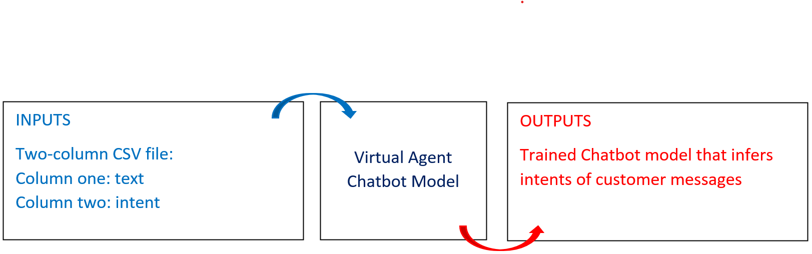
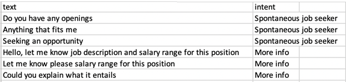
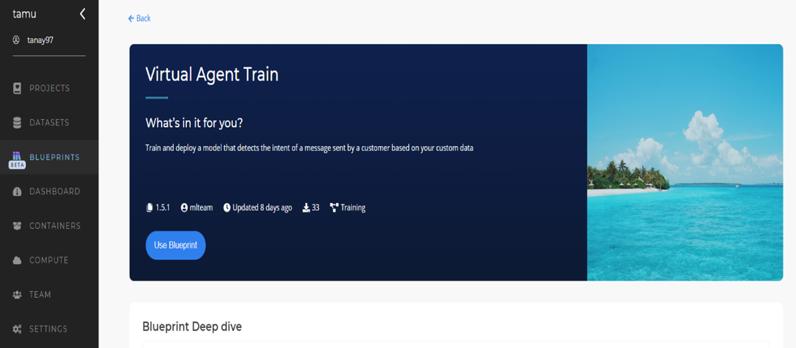
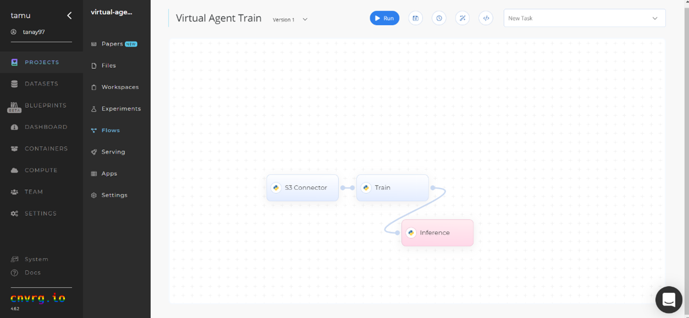
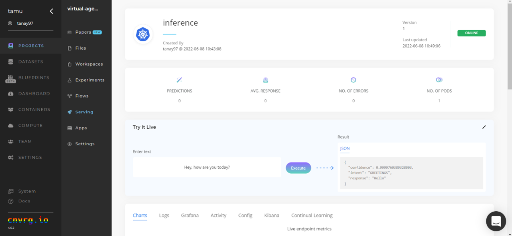
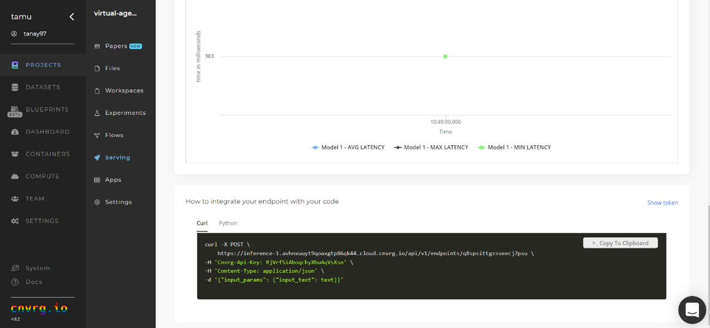

# Virtual Agent (Chatbot) Train
A chatbot is a computer program that simulates and processes human conversation, allowing people to interact with digital devices as if they were communicating with a real person. This chatbot's main goal is to serve as a virtual agent that allows businesses to communicate with their customers without requiring human resources.

## Blueprint Overview
The following diagram provides an overview of this blueprint's inputs and outputs.

## Blueprint Purpose
Use this blueprint to train a tailored model that infers the intent of a customer message based on your custom data. To train this model with your data, you need to provide data in the form of text sentences and their intents.

This blueprint retrains a neural network on the custom dataset. The result is a trained model file that can be used to build a chatbot that meets an organization's needs by detecting customer intents and generating responses accordingly. This blueprint also establishes an endpoint that can be used to make inferences for customer message intents based on the newly trained model.

## Blueprint Flow
The following list provides a high-level flow of this blueprint's run:
- Upload the training dataset which is a collection of possible messages mapped to their intent. Ensure the dataset is a CSV file having a two column format, with column one containing the text and column two containing the intent, as the following example table illustrates:

- Train the model on the extended dataset to produce a model file. The model can then be used for a personalized business chatbot.

## Blueprint Arguments/Artifacts
### Inputs
- `--data` is the base training dataset.
- `--additional_data` refers to the additional training dataset that contains the data unique to the business.
- `--model_file` is the model's file name.

### Outputs
- `chatbot_model.pt` is the file that contains the retrained model, which can be used in the future for detecting the intent of a customer's message.

## Training Instructions
Complete the following steps to train the chatbot model:
1. Click the **Use Blueprint** button.

2. The cnvrg Blueprint Flow page displays. In the flow, edit the `Train` task to provide the path to the dataset for the data parameter.

::: tip NOTE
This path refers to the base training data, not data for fine-tuning the model. The following link stores the default base training data: http://s3.amazonaws.com. Also, use the `--additional_data` parameter to include business-specific data for training.
:::

3. Click the blue **Run** button.

   In a few minutes, cnvrg trains a new text intent detection model and deploys it as a new API endpoint.
4. Click the **Serving** tab in the project and locate your endpoint.
5. Complete one or both of the following options:
   - Use the Try it Live section with any text to check the model to infer the intent.

   - Use the bottom Integration panel to integrate your API with your code.

A custom model that can infer the intents of customer messages has now been trained and deployed.

## Related Blueprints
Refer to the following blueprints related to this Virtual Agent (Chatbot) Training blueprint:
- [Sentiment Analysis Training](../Sentiment%20Analysis/train_blueprint_README.md)
- Slack Connector Training
